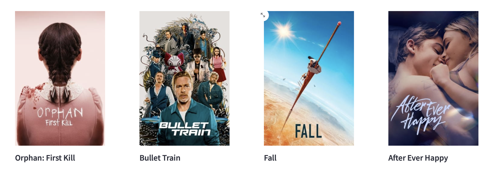

# CS50P - Final Project: Movie/TV Popular Listing

### Description:
This is my CS50P - Programming with Python final project. Due to having constrained time to work I couldn't implement as many features as I wanted. In the end the project simply became a  good training exercise in using Python dashboards (Streamlit), in using Webscraping (beautifuSoup) and on interacting with API:s in the form of themoviedb.org.For some reason, the API for images was not working. While annoying, I got some good experience in web scraping instead.

### Features
You can choose between the most popular movies or TV shows. The app will then query themovie.db.org and receive the chosen top list in the for of 20 titles. The webscraper then goes through each title by ID, goes to their page and gets the image URL.

### Problems
By chosing a format as Streamlit to present the information in, I was severely restricted in placements and formatting of various elements on the screen. It makes sense as Streamlit is not even meant for the application I am using it for, but it still did a good enough job on a very tight time budget.

### Testing
There is a file included called test_project_py. It mainy checks for raised ValueErrors, to see what the function does when they receive the inappropiate values that are not "tv" or "movie". A major flaw of this project was also the fact that test driven development was much harder to implement as the functions are not that "flexible". They are very limited in what they take in and what they output.

### Functions
The entire program consists of five functions, including main. Main called the streamlit() function that creates the first interface where two buttons are provided with a onclick function with value of either "tv" or "movie". It then call the API_request() function that queries the API for the most popular 20 shows or 20 movies and then calls the image_scrape() function where ID is provided from the API to scrape the images.

### Requirements
Streamlit, beautifulSoup, requests, themoviedb.org API key.
